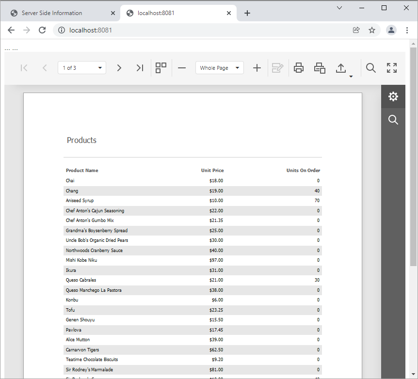

<!-- default badges list -->

[](https://supportcenter.devexpress.com/ticket/details/T848276)
[](https://docs.devexpress.com/GeneralInformation/403183)
[](#does-this-example-address-your-development-requirementsobjectives)
<!-- default badges end -->
# Reporting for JavaScript - How to Perform the Document Viewer Integration (with npm or Yarn package managers)

This example demonstrates how to integrate the [HTML5 Document Viewer](https://docs.devexpress.com/XtraReports/17738) in a JavaScript application based on the server-side model.



## Implementation Details

This example consists of two parts: 

- A server (back-end) ASP.NET Core project that enables [cross-domain requests (CORS)](https://developer.mozilla.org/en-US/docs/Web/HTTP/CORS) (Access-Control-Allow-Origin) and implements a custom web report storage.
- Document Viewer front-end client JavaScript application.

Perform the following steps to run this example:

1. Open the back-end project solution (**CS\ServerSide.sln**) in Visual Studio and run the project.
2. Navigate to the **JS\ClientSide** folder which is the client part's root folder.
3. Open the console and run the following command:
    - if you have the **npm** package manager:

        ```npm install```
    - if you have the **Yarn** package manager:
        
        ```yarn install```    

4. Host the client-side part ( **JS\ClientSide** folder ) on the web server. You can add a new website in the **Internet Information Services (IIS) Manager**.
5. Launch the browser and open the website created in the previous step.

## Documentation

* [Basic Document Viewer Integration (with npm or Yarn package managers)](https://docs.devexpress.com/XtraReports/401546)
<!-- feedback -->
## Does this example address your development requirements/objectives?

[](https://www.devexpress.com/support/examples/survey.xml?utm_source=github&utm_campaign=reporting-javascript-basic-viewer-integration&~~~was_helpful=yes) [](https://www.devexpress.com/support/examples/survey.xml?utm_source=github&utm_campaign=reporting-javascript-basic-viewer-integration&~~~was_helpful=no)

(you will be redirected to DevExpress.com to submit your response)
<!-- feedback end -->
